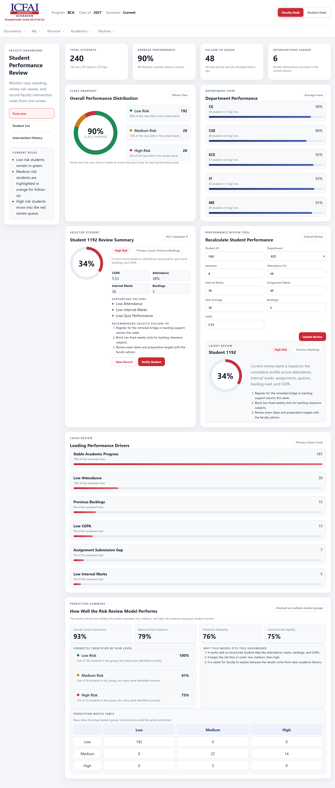
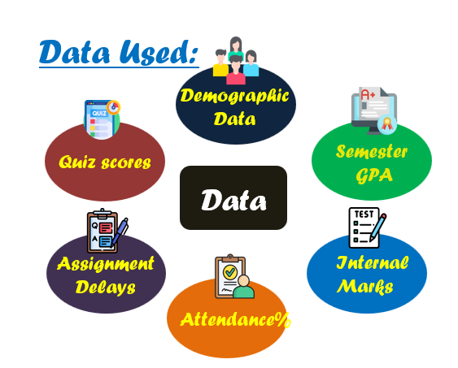
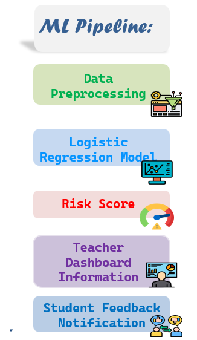
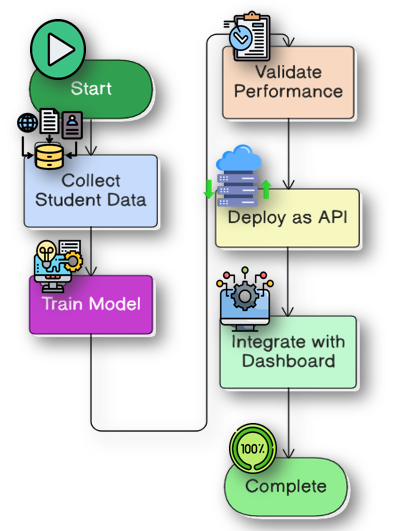

<div align="center">


# Shiksha Mitra  
### AI-Powered Student Risk Detection & Early Intervention for University SIMS

[**🔗 Live Demo**](https://shiksha-mitra-xzdx.onrender.com/) 

It may take some time be patient please

</div>

---

## 🎯 Overview

**Shiksha Mitra** is a full-stack academic early-warning system built for real university SIMS workflows.

It transforms raw academic records into structured faculty action.

Instead of only displaying marks and attendance, it answers three practical questions:

- **Who is at risk?**
- **Why are they at risk?**
- **What should faculty do next?**

The result is a deployable decision-support product combining:

- A faculty dashboard  
- A student improvement view  
- An interpretable AI risk engine  

---

## 🖥 Product Preview

<p align="center">
  
</p>

<p align="center"><em>Faculty-first dashboard with risk analysis, cause detection, and intervention tracking.</em></p>

---

## 🚩 Problem → Solution Mapping

| University Challenge | Shiksha Mitra Solution |
|----------------------|------------------------|
| Risk detected too late | Early structured risk classification |
| Manual scanning of records | Prioritized student surfacing |
| Students unaware of root cause | Cause-based academic explanation |
| Informal intervention | Logged and trackable improvement plan |

---

## ✨ Core Capabilities

### 1️⃣ Faculty Dashboard
- Class-wide risk distribution
- Department-level performance summary
- Search, filter, and sort student records
- Deep-dive student analysis
- One-click intervention logging

### 2️⃣ Student Performance Review
Each student profile includes:
- Risk band (Low / Medium / High)
- Performance score
- Primary academic cause
- Supporting indicators
- Faculty recommendation

### 3️⃣ Cause-Based Risk Detection
Model highlights structured factors such as:
- Attendance percentage  
- Internal marks  
- Assignment gaps  
- Quiz performance  
- Backlogs  
- CGPA  

### 4️⃣ Closed-Loop Intervention
When faculty clicks **Notify**:
- The action is logged  
- Student dashboard updates  
- Recommendation becomes a visible improvement plan  

---

## 🧠 AI Engine

### 📊 Input Features

- `Department`
- `Semester`
- `Attendance_Percentage`
- `Internal_Marks`
- `Assignment_Marks`
- `Quiz_Average`
- `Backlogs_Count`
- `CGPA`

<p align="center">
  
</p>

---

### ⚙ Machine Learning Pipeline

<p align="center">
  
</p>

---

### 📌 Model Choice

An **Ordinal Logistic Regression** model is used because academic performance is naturally ordered:

```
Low Risk -> Medium Risk -> High Risk
```

Why this works well in a university setting:

- Interpretable outputs  
- Lightweight and fast  
- Structured-data friendly  
- Easy retraining for new semesters  
- Ideal for dashboards and real-time analysis  

---

## 🔄 End-to-End Implementation Flow

<p align="center">
  
</p>

<p align="center"><em>From data ingestion to live faculty intervention.</em></p>

---

## 👨‍🏫 Faculty Demo Flow

1. Open dashboard  
2. Review class distribution  
3. Search a student  
4. Inspect detected cause  
5. Recalculate performance (Analyzer)  
6. Click **Notify** to trigger intervention  

---

## 🎓 Student Experience

1. Open student dashboard  
2. View alert and improvement plan  
3. Track actionable academic guidance  

---

## 🏗 Tech Stack

| Layer | Technology |
|-------|------------|
| Frontend | HTML, CSS, Vanilla JS |
| Backend | FastAPI |
| AI / ML | Python, pandas, NumPy, scikit-learn |
| Storage | SQLite |
| Deployment | Render |

---

## 📁 Project Structure


The folder structure of **Shiksha Mitra** is organized to keep the backend, frontend, and data components clearly separated for better readability and scalability.

```
Shiksha-Mitra/
│
├── app.py
├── requirements.txt
│
├── backend/
│   ├── app.py
│   ├── model_engine.py
│   └── __init__.py
│
├── data/
│   └── imbalanced_train.csv
│
├── public/
│   ├── index.html
│   ├── styles.css
│   ├── app.js
│   └── logo.jpg
│
└── ui-ux design.png
```

---

## 🔌 API Snapshot

| Endpoint | Purpose |
|----------|---------|
| `/health` | Backend status check |
| `/students` | Faculty review list |
| `/students/{id}` | Detailed student profile |
| `/analyze-risk` | Live risk recalculation |
| `/class-analytics` | Distribution insights |
| `/dashboard-metrics` | Summary statistics |
| `/model-metrics` | ML evaluation metrics |
| `/notifications` | Create & fetch interventions |

---

## 🚀 Run Locally

once inside the folder
```bash
pip install -r requirements.txt
python -m uvicorn app:app --reload
```

Then open:

```text
http://127.0.0.1:8000
```

## 🔮 Future Scope

- Role-based login for faculty, students, and administrators
- Advisor scheduling and meeting history
- Persistent cloud database for interventions
- Semester-over-semester trend analysis
- Email, SMS, or WhatsApp notification delivery
- Longitudinal recovery tracking for at-risk students


## Business Model

| Aspect | Details |
|--------|----------|
| Target Market | B2B SaaS platform for universities and colleges, integrated with existing SIMS systems |
| Revenue Model | Annual subscription with tiered pricing based on total student strength |
| Cost Structure | Cloud hosting, storage, API bandwidth, and system maintenance (lightweight ML keeps compute costs low) |
| Scalability | Multi-institution deployment with isolated data and horizontal backend scaling |
| Future Expansion | Sentiment analysis, AI academic tutor, dropout prediction, automated alerts, advanced analytics |


## "Shiksha Mitra is not just a dashboard. It is a decision-support system for academic care."

It helps an institution move from delayed reaction to timely intervention, using data that universities already collect but rarely convert into action with this level of clarity.

For a hackathon, it demonstrates the combination that matters most:
- meaningful social impact
- usable AI
- full-stack execution
- strong product thinking
  </p>
</div>

---


