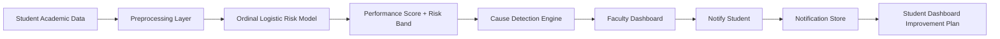

# Shiksha Mitra


**Shiksha Mitra** is an AI-powered student academic risk and early-intervention platform built for a university SIMS environment. It helps faculty identify students who may be falling behind, understand the reason quickly, and trigger a clear improvement plan that appears on the student dashboard.

**Live Demo:** [https://shiksha-mitra-xzdx.onrender.com/](https://shiksha-mitra-xzdx.onrender.com/)

## Why This Project Matters

Universities already collect academic data such as attendance, internal marks, quiz scores, assignments, CGPA, and backlog history. The real problem is that this data often stays fragmented and reactive.

**Shiksha Mitra solves that gap by turning raw student records into clear action.**

It helps institutions move from:
- late academic warnings
- manual review overload
- unclear follow-up actions
- disconnected teacher-student communication

to:
- early risk detection
- explainable performance analysis
- fast faculty intervention
- visible student improvement plans

## What Makes Shiksha Mitra Strong in a Hackathon

- **Real AI model, not mock logic**: the system uses a trained ordinal logistic regression model on academic records.
- **Interpretable output**: faculty do not just see a score, they see *why* the student is at risk.
- **Immediate intervention flow**: the teacher can notify the student directly from the dashboard.
- **Dual-user product design**: one system serves both faculty and students.
- **Deployable full-stack product**: live web application, backend APIs, ML engine, notifications, and a polished dashboard experience.
- **Institution-ready use case**: this is built for a real university SIMS-style workflow, not a generic demo page.

## The Core Idea

Shiksha Mitra continuously evaluates academic health using structured student data and classifies performance into three levels:

- **Low Risk**: healthy academic standing
- **Medium Risk**: requires follow-up and monitoring
- **High Risk**: urgent faculty intervention needed

Each analysis produces:
- a **performance score**
- a **risk band**
- a **primary cause**
- a **recommended action plan**

## Key Product Features

### 1. Faculty Dashboard
The faculty view is designed for quick academic review and action.

Faculty can:
- view class-wide performance distribution
- inspect department-wise academic trends
- browse a searchable and paginated student risk table
- identify risk using green, orange, and red status cues
- open a detailed review for any student
- trigger intervention notifications directly from the dashboard

### 2. Student Performance Analyzer
The analyzer recalculates student risk from academic inputs such as:
- attendance percentage
- internal marks
- assignment marks
- quiz average
- backlog count
- CGPA

This allows faculty to test how a student?s profile changes as academic conditions improve or worsen.

### 3. Cause Detection and Recommendation Engine
The system does not stop at prediction.

It identifies the likely academic driver behind weak performance, such as:
- low attendance
- previous backlogs
- assignment submission gap
- low internal marks
- low quiz performance
- low CGPA

For each cause, the platform generates a clear point-wise recommendation list for follow-up.

### 4. Intervention and Notification Loop
Faculty can click **Notify** to create a personalized intervention record.

That intervention is then reflected in the student portal as:
- **Alert**
- **Recommendation**
- **Improvement Plan**

This closes the loop between prediction and action.

## AI and Data Science Layer

### Input Dataset
The model uses the following academic features:
- `Student_ID`
- `Department`
- `Semester`
- `Attendance_Percentage`
- `Internal_Marks`
- `Assignment_Marks`
- `Quiz_Average`
- `Backlogs_Count`
- `CGPA`
- `Risk_Label`

### Preprocessing
The ML pipeline applies:
- **OneHotEncoder** for the department field
- **StandardScaler** for numerical academic indicators
- type normalization and severity scoring for cleaner training behavior

### Model Choice
The system uses an **ordinal logistic regression approach** built on top of logistic regression.

This is a strong fit because:
- student risk is naturally ordered as **low -> medium -> high**
- the model stays interpretable for faculty and judges
- it works well for structured tabular university data
- it is fast enough to retrain and demonstrate in a hackathon setting

### Imbalance Handling
The original academic-risk data is imbalanced, so the model uses:
- `class_weight='balanced'`

to reduce bias toward the majority class.

### Model Output
For each student, the AI layer produces:
- performance score from 0 to 100
- probability-based risk understanding
- low / medium / high risk band
- primary academic cause
- suggested intervention actions

## Measured Model Performance

The current model evaluation is based on **5-fold stratified cross-validation**.

User-friendly summary:
- **Overall Correct Predictions**: **92.92%**
- **Balanced Risk Detection**: **78.70%**
- **Prediction Reliability**: **75.71%**
- **Overall Model Stability**: **74.52%**

What this means in simple terms:
- the system is strong at separating healthy and at-risk students
- it remains reasonably balanced across the three risk levels
- it is accurate enough to be used as a decision-support layer for faculty intervention

## End-to-End System Flow



## What Judges Will See in the Demo

### Faculty Side
- a university-style dashboard with class-level analytics
- a color-coded risk table with student-level review
- a performance meter for each student
- the likely reason for weak performance
- one-click intervention logging

### Student Side
- a clean student dashboard
- current performance meter
- personalized alert based on faculty action
- a clear point-wise improvement plan

## Suggested 2-Minute Demo Flow

1. Open the **Faculty Dashboard**.
2. Show the overall class distribution and department performance.
3. Search for a student in the review queue.
4. Open the student summary and highlight the detected cause.
5. Recalculate the student profile using the analyzer.
6. Click **Notify** to create an intervention.
7. Switch to the **Student Dashboard**.
8. Show how the same intervention appears as a personalized improvement plan.

This demo flow clearly proves:
- real data analysis
- explainable AI
- full-stack product depth
- actionable educational impact

## Tech Stack

### Frontend
- HTML
- CSS
- Vanilla JavaScript

### Backend
- FastAPI
- SQLite for notification storage

### AI / Data Science
- Python
- pandas
- NumPy
- scikit-learn

### Deployment
- Render

## Project Structure

```text
Shiksha-Mitra/
??? app.py
??? requirements.txt
??? backend/
?   ??? app.py
?   ??? model_engine.py
?   ??? __init__.py
??? data/
?   ??? imbalanced_train.csv
??? public/
    ??? index.html
    ??? styles.css
    ??? app.js
    ??? logo.jpg
```

## API Overview

| Endpoint | Purpose |
|---|---|
| `/health` | backend health check |
| `/students` | paginated student review data |
| `/students/{student_id}` | detailed student review |
| `/analyze-risk` | analyze a student input profile |
| `/class-analytics` | class-level summary and distributions |
| `/dashboard-metrics` | key faculty dashboard metrics |
| `/model-metrics` | model evaluation summary |
| `/notifications` | create and fetch intervention records |

## Local Run

```bash
pip install -r requirements.txt
python -m uvicorn app:app --reload
```

Then open:

```text
http://127.0.0.1:8000
```

## Why Shiksha Mitra Deserves Attention

Shiksha Mitra is not just a prediction screen. It is a full academic support loop.

It combines:
- institutional relevance
- interpretable AI
- clean faculty workflow
- student-facing intervention delivery
- deployable engineering execution

In a hackathon context, that combination is powerful because it demonstrates both **technical depth** and **real educational value**.

## Future Scope

This project can be extended into a larger campus intelligence platform with:
- role-based authentication for faculty, students, and administrators
- department-wise trend reports across semesters
- email / SMS / WhatsApp alert delivery
- persistent cloud database for interventions
- advisor meeting scheduling
- longitudinal student recovery tracking
- stronger retraining pipelines on larger university datasets

## Final Note

**Shiksha Mitra** is built to answer one important question clearly:

**?Which students need help early, why do they need it, and how can the university act before it is too late??**

That is the heart of this product.
