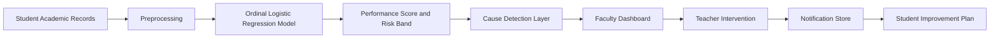

<div align="center">
  
  <h1>Shiksha Mitra</h1>
  <p><strong>AI-Powered Student Risk Detection and Early Intervention for University SIMS</strong></p>
  <p>
    <a href="https://shiksha-mitra-xzdx.onrender.com/"><strong>Live Demo</strong></a>
    |
    <a href="#suggested-demo-flow"><strong>Demo Flow</strong></a>
    |
    <a href="#ai-engine"><strong>AI Engine</strong></a>
  </p>
</div>

---

## Overview

**Shiksha Mitra** is a full-stack academic early-warning system designed for a university SIMS workflow. It transforms raw academic records into a clear faculty action system.

Instead of showing only marks and attendance, it answers three practical questions:

- **Which students are slipping?**
- **Why are they slipping?**
- **What should faculty do next?**

The platform combines a clean faculty dashboard, a student-facing improvement plan, and an interpretable AI risk engine in one deployable product.

## Product Preview

<p align="center">
  
</p>

<p align="center"><em>Faculty-first university dashboard with academic risk analysis, intervention tracking, and student improvement planning.</em></p>

## Why This Project Stands Out

| Challenge in Universities | What Shiksha Mitra Does |
|---|---|
| Academic data exists, but action comes too late | Detects risk early using structured student performance data |
| Teachers spend time manually scanning records | Surfaces the most important students first |
| Students know they are struggling, but not why | Identifies the main academic cause behind low performance |
| Intervention is usually informal and disconnected | Creates a visible teacher-to-student improvement record |

## Why Judges Should Care

- **Real use case**: built for a university SIMS environment, not a generic analytics demo.
- **Real AI**: uses an ordinal logistic regression pipeline, not static if-else scoring alone.
- **Explainable output**: every prediction is paired with a clear academic cause.
- **Action-oriented design**: prediction leads directly to notification and follow-up.
- **Full-stack execution**: working frontend, backend, ML pipeline, analytics, and deployment.
- **Demo-friendly clarity**: judges can understand the problem, the AI, and the impact within minutes.

## Core Capabilities

### 1. Faculty Dashboard
Faculty can:
- review class-wide performance in one screen
- inspect low, medium, and high risk distribution
- search, sort, and filter the student review list
- open detailed student performance summaries
- trigger interventions instantly

### 2. Student Performance Review
Each student record includes:
- performance score
- risk band
- primary cause
- supporting factors
- faculty recommendation

### 3. Cause-Based Intervention
The system highlights likely reasons such as:
- low attendance
- backlog burden
- assignment submission gap
- low internal marks
- weak quiz performance
- low CGPA

### 4. Notification Loop
After a teacher clicks **Notify**:
- the intervention is logged
- the student dashboard reflects the alert
- the recommendation becomes a personalized improvement plan

## AI Engine

### Input Features
The model uses real academic indicators from the dataset:
- `Department`
- `Semester`
- `Attendance_Percentage`
- `Internal_Marks`
- `Assignment_Marks`
- `Quiz_Average`
- `Backlogs_Count`
- `CGPA`
- `Risk_Label`

### Preprocessing
The ML pipeline applies:
- **OneHotEncoder** for department
- **StandardScaler** for numeric features
- data refinement and severity scoring before ordinal labeling

### Model Choice
The system uses an **ordinal logistic regression approach** because academic status is naturally ordered:

**Low Risk -> Medium Risk -> High Risk**

This makes the model a strong fit for a university dashboard because it is:
- explainable
- lightweight
- structured-data friendly
- suitable for quick retraining and live demos

### Imbalance Handling
The dataset is imbalanced, so the model uses:
- `class_weight='balanced'`

to improve fairness across risk groups.

## Model Performance

The evaluation is based on **5-fold stratified cross-validation**.

| Human-Friendly Metric | Current Result |
|---|---|
| Overall Correct Predictions | **92.92%** |
| Balanced Risk Detection | **78.70%** |
| Prediction Reliability | **75.71%** |
| Overall Model Stability | **74.52%** |

### What These Numbers Mean
- the model is strong at separating stable students from students needing intervention
- it remains reasonably balanced across low, medium, and high risk groups
- it is accurate enough to support faculty review decisions in a hackathon demo context

## End-to-End Flow



## Suggested Demo Flow

### Faculty View
1. Open the live dashboard.
2. Show the class performance distribution and department summary.
3. Search for a student in the review list.
4. Open the student summary and explain the detected cause.
5. Use the analyzer to recalculate the student record.
6. Click **Notify** to create an intervention.

### Student View
7. Switch to the student dashboard.
8. Show the updated alert and recommendation.
9. Explain how faculty action becomes a visible improvement plan.

### What This Demo Proves
- AI is actively analyzing student performance
- the system is explainable, not a black box
- intervention is built into the workflow
- the product is usable by both faculty and students

## Tech Stack

| Layer | Technology |
|---|---|
| Frontend | HTML, CSS, Vanilla JavaScript |
| Backend | FastAPI |
| AI / Data Science | Python, pandas, NumPy, scikit-learn |
| Storage | SQLite |
| Deployment | Render |

## Project Structure

```text
Shiksha-Mitra/
??? app.py
??? requirements.txt
??? backend/
?   ??? app.py
?   ??? model_engine.py
?   ??? __init__.py
??? data/
?   ??? imbalanced_train.csv
??? public/
?   ??? index.html
?   ??? styles.css
?   ??? app.js
?   ??? logo.jpg
??? ui-ux design.png
```

## API Snapshot

| Endpoint | Purpose |
|---|---|
| `/health` | backend health check |
| `/students` | paginated faculty review data |
| `/students/{student_id}` | detailed student summary |
| `/analyze-risk` | live performance analysis |
| `/class-analytics` | class distribution and department analytics |
| `/dashboard-metrics` | top-level faculty dashboard counts |
| `/model-metrics` | AI evaluation summary |
| `/notifications` | intervention create and fetch |

## Local Run

```bash
pip install -r requirements.txt
python -m uvicorn app:app --reload
```

Then open:

```text
http://127.0.0.1:8000
```

## Future Scope

- role-based login for faculty, students, and administrators
- advisor scheduling and meeting history
- persistent cloud database for interventions
- semester-over-semester trend analysis
- email, SMS, or WhatsApp notification delivery
- longitudinal recovery tracking for at-risk students

## Closing Statement

**Shiksha Mitra is not just a dashboard. It is a decision-support system for academic care.**

It helps an institution move from delayed reaction to timely intervention, using data that universities already collect but rarely convert into action with this level of clarity.

For a hackathon, it demonstrates the combination that matters most:
- meaningful social impact
- usable AI
- full-stack execution
- strong product thinking
